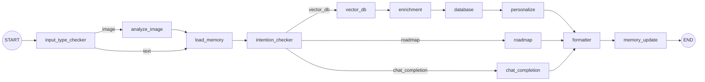

# Book Recommendation Agent Server

FastAPI + WebSocket + LangGraph 기반 대화형 도서 추천 에이전트. MongoDB(메타데이터) + Milvus(임베딩, COSINE) 사용.

## 최종 보고서 대상 개선 사항

| # | 기능 | 구현 위치 |
|---|------|-----------|
| 1 | 실시간 데이터 파이프라인 및 자동 강화 | `agent/enrichment/` |
| 2 | 맥락·난이도 기반 독서 로드맵 | `agent/roadmap/` |
| 3 | 장기기억 기반 초개인화 | `agent/memory/`, `database/profile_store.py` |

### 그래프



### [1] 실시간 데이터 파이프라인 및 자동 강화
대화 중 DB에 없는/빈약한 도서를 감지하면 외부 소스에서 수집 → LLM으로 구조화 → Mongo + Milvus에 즉시 적재한다. 추천 풀이 대화를 통해 스스로 커진다.

- **감지 조건** (`enrichment_node`)
  1. 사용자가 기준으로 언급한 책(`mentioned_books`, 예: "데미안 같은 책")이 DB에 없음 → 수집·적재 후 그 책의 내용을 **앵커**로 재검색 (앵커 자신은 결과에서 제외)
  2. 검색 품질 저하 (최고 유사도 < `ENRICH_SCORE_THRESHOLD`(0.40) 또는 결과 3건 미만) → LLM이 실존 후보 도서 3권 제안 → 수집·적재 → 재검색
  3. 결과 중 설명이 빈약한 도서(200자 미만, 미보강) → **백그라운드**로 보강 (응답 지연 없음)
- **수집 소스** (`agent/enrichment/sources.py`): Open Library(서지·설명·주제), Wikipedia ko/en(직접 조회 + 검색 = 웹 검색 역할), Google Books(`GOOGLE_BOOKS_API_KEY` 있을 때)
- **LLM 추출 스키마** (`ExtractedBook`): 한국어 줄거리, 키워드, 분위기(mood), **감정선(emotional_arc)**, 전개 속도(pace), 난이도(intro/popular/advanced), 주제, 영문 임베딩 텍스트. 근거로 실존이 확인되지 않으면 `is_real_book=false`로 적재 거부 (환각 방지)
- 동일 제목 동시 요청은 하나의 태스크로 합쳐지고(idempotent), 정규화 제목(`title_key`)으로 중복 적재를 막는다.
- Milvus 검색은 `consistency_level="Strong"` → 방금 적재한 책도 즉시 검색된다.
- 진행 상황은 LangGraph `custom` 스트림으로 실시간 전송 (`ENRICH_PROGRESS` 이벤트)

### [2] 맥락 및 난이도 기반 독서 로드맵
"~를 처음부터 공부하고 싶어", "로드맵", "입문" 등 탐구 의도 → `roadmap` 라우트.

1. **Plan**: 주제, 현재 지식 수준(beginner/intermediate/advanced, 근거 포함), 감정 상태 추정 + 단계별(입문서→대중서→심화·전문서) 검색 쿼리와 대표 도서 제안. 장기기억의 지식수준·기피 소재 반영
2. **Gather**: 단계별로 대표 도서를 [1]의 파이프라인으로 확보(없으면 실시간 적재) + 벡터 검색 후보 수집
3. **Curate**: 단계별 후보 id 안에서만 1~2권 선택, 선택 이유, 다음 단계로 넘어가는 **bridge**, 사용자 수준·상태에 맞춘 **첫 책** 지정
4. 출력 `READING_ROADMAP` (시작 단계 하이라이트, ⭐ 첫 책)

### [3] 장기기억 기반 추천 고도화
- 브라우저별 `user_id`(localStorage)를 WS 쿼리로 전달 → Mongo `user_profiles`에 영속
- 프로필: 좋아한/싫어한 책(+이유), 관심사, 기피 소재, 선호 스타일, 주제별 지식수준, 추천 이력
- **학습**: 매 턴 `memory_update` 노드가 발화에서 지속적 취향만 추출 ("첫 번째 책 지루했어" → 추천 이력의 해당 책 id로 해석해 dislike 저장). 카드의 👍/👎 버튼은 즉시 저장
- **활용**
  - 의도 분석/쿼리 생성에 기억 주입 (선호 스타일 반영, 기피 소재 제외)
  - 이미 추천/평가한 책은 Milvus `expr`로 검색 단계에서 제외
  - `personalize` 노드: 기피 소재와 충돌하는 책 제거, 기억 기준 재정렬, 책별 `personal_reason`, "지난번 A처럼 빠른 전개를 좋아하시니…" 형태의 인트로 생성
- UI 우측 "🧠 내 취향 기억" 패널에서 실시간 확인/초기화

### 실시간 스트리밍 (1·2·3 모두 "지금 무엇을 하는 중인지" 전송)
노드 완료 이벤트(`updates`)뿐 아니라, 긴 작업 **도중**의 진행 상황을 LangGraph `custom` 스트림으로 즉시 WebSocket에 흘려보낸다. UI는 각 이벤트를 배지로 쌓고, 입력창 위 라이브 상태줄(●)에 현재 단계를 표시한다.

| 기능 | status | 스트리밍되는 순간 |
|---|---|---|
| [1] 보강 | `ENRICH_PROGRESS` | 풀 점검(유사도·언급 도서) → 보강 후보 제안 → 외부 수집 시작 → 근거 N건 → LLM 추출 → **적재 완료(키워드·감정선)** / 거부(근거 없음) |
| [1] 백그라운드 보강 | `ENRICH_PROGRESS` + `background: true` | 턴 종료(DONE) **이후** 빈약 도서 보강이 끝나면 사용자 소켓으로 push |
| [2] 로드맵 | `ROADMAP_PROGRESS` | 수준·감정 판단 → 단계별 후보 탐색 → (보강 이벤트) → 후보 수집 완료 → STEP별 선정 결과 |
| [3] 기억 | `THINKING:memory`, `MEMORY` | 불러온 기억 요약 → 개인화 중 → 기억 정리 중 → **실제로 새로 기억한 항목만 diff로** (👎 'A'(지루함), +선호 '빠른 전개' …) |

## 로컬 실행

```bash
# 1) Mongo(27018) + Milvus(19530) — embedded etcd / local storage
docker compose -f infra/docker-compose.yaml up -d

# 2) Python env
python3 -m venv venv && ./venv/bin/pip install -r requirements.txt
cp .env.template .env   # OPENAI_API_KEY, DATABASE_URL=mongodb://localhost:27018

# 3) 테스트 데이터 (Goodreads refined 샘플 100권)
./venv/bin/python scripts/seed_books.py --reset

# 4) 서버
./venv/bin/uvicorn app_ws:app --port 8000   # http://localhost:8000
```

### 테스트
- `python tests/smoke_offline.py` — LLM을 스텁으로 바꾸고 실제 Mongo/Milvus/외부 API로 3개 기능 흐름 검증
- 데모 시나리오 (UI 힌트 버튼)
  1. `데미안 같은 성장소설 추천해줘` → DB에 없는 '데미안'을 실시간 적재 후 앵커 검색 (`ENRICH` 배지)
  2. `나는 전개가 빠른 책을 좋아하고, 잔인한 묘사는 싫어해. 첫 번째 추천 책은 너무 지루했어.` → 기억 저장 (`MEM` 배지, 우측 패널)
  3. `판타지 소설 추천해줘` → 기억 기반 개인화 인트로/정렬, 이전 추천·비선호 도서 제외
  4. `행동경제학을 처음부터 공부하고 싶어. 요즘 좀 지쳐 있어서…` → 3단계 로드맵

### API
| Method | Path | 설명 |
|---|---|---|
| WS | `/ws/chat?user_id=` | 채팅. `{"text"}` 또는 `{"type":"feedback","book_id","title","rating":"like|dislike"}` |
| GET | `/api/search?message=` | 벡터 검색 |
| POST | `/api/enrich` | `{"title","author?","title_en?"}` 수동 보강 |
| GET | `/api/books/enriched` | 실시간 적재된 도서 목록 |
| GET/DELETE | `/api/profile/{user_id}` | 장기기억 조회/초기화 |
| GET | `/api/stats` | 전체/적재 도서 수 |
